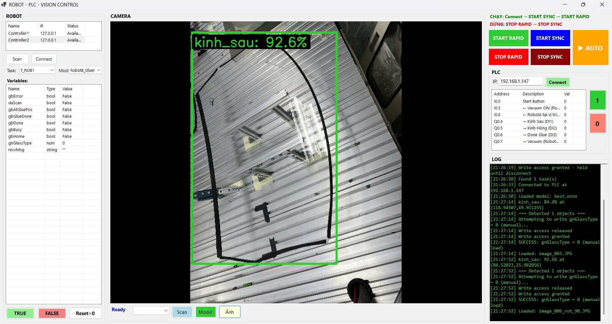

# 🤖 Robotic Glazing System (Industrial Hybrid Control)

> A high-performance, PC-based industrial control system that orchestrates **ABB Robotic Arms**, **Siemens PLC**, and **AI Computer Vision (YOLO)** for autonomous glass glazing and assembly. **Synchronized hardware-level control with a premium WinForms dashboard.**

---

## 📋 Table of Contents
1. [System Overview](#-1-system-overview)
2. [Prerequisites](#-2-prerequisites)
3. [Installation](#-3-installation)
4. [Architecture Flow](#-4-architecture-flow)
5. [Auto Cycle Logic](#-5-auto-cycle-logic)
6. [Dashboard Guide](#-6-dashboard-guide)
7. [Hardware Communication](#-7-hardware-communication)
8. [Project Structure](#-8-project-structure)
9. [FAQ](#-9-faq)

---

## 🚀 1. System Overview
The **Robotic Glazing System** acts as the central "Brain" for a complex assembly line. It solves the fragility and precision requirements of industrial glazing by fusing:
- 👁️ **Vision Engine**: Real-time YOLO detection to identify glass types and coordinates.
- 🦾 **Robot Orchestration**: Binary command protocol to ABB Robot controllers.
- ⚡ **PLC Logic**: High-speed Profinet communication with Siemens S7-1200/1500.

### What does it do?
1. **Identifies** the target glass type using a skip-frame YOLO ONNX pipeline.
2. **Synchronizes** two robots: **Robot B** (Glazing side) and **Robot A** (Assembly side).
3. **Controls** the physical glue valve via PLC high-speed outputs (Q0.7) triggered by Robot B's spatial events.
4. **Validates** each step via visual feedback and hardware status bits.

---

## 🛠 2. Prerequisites

### Hardware
| Component | Requirement | Role |
|-----------|-------------|------|
| **Robot B** | ABB IRB (with PC Interface option) | Glazing & Camera movement |
| **Robot A** | ABB IRB | Loading & Final Assembly |
| **PLC** | Siemens S7-1200 / S7-1500 | Valve control & I/O bridging |
| **Camera** | USB 3.0 / Industrial IP Cam | Real-time AI Scan inputs |

### Software
| Component | Version | Role |
|-----------|---------|------|
| **Visual Studio** | 2022+ | IDE |
| **.NET SDK** | 9.0 | Runtime environment |
| **RobotStudio** | 2025 (Optional) | Simulation & SDK provider |

---

## 📦 3. Installation

### Step 1: Clone the repository
```bash
git clone https://github.com/zablee-dev/RoboticGlazingSystem.git
cd RoboticGlazingSystem
```

### Step 2: Restore Libraries (NuGet)
Open the **Package Manager Console** in Visual Studio and run:
```powershell
Install-Package S7netplus -Version 0.20.0
Install-Package OpenCvSharp4 -Version 4.11.0.20250507
Install-Package OpenCvSharp4.Extensions -Version 4.11.0.20250507
Install-Package OpenCvSharp4.runtime.win -Version 4.11.0.20250507
Install-Package Microsoft.ML.OnnxRuntime -Version 1.23.2
```

### Step 3: Verify ABB PC SDK
The core ABB DLLs are pre-bundled in the `Libraries/ABB/` folder. The project is configured to use these relative files, so **installing RobotStudio is not strictly required** on the production PC.

---

## 🏗 4. Architecture Flow
```
┌─────────────────────────────────────────────────────────────┐
│                    PC CONTROL (MainForm.cs)                 │
│                                                             │
│  [ UI Dashboard ] ←─→ [ PLC Manager ] ←─→ [ Robot Manager ] │
│          ↑                  ↑                   ↑           │
│          └───────────┬──────┴──────────┬────────┘           │
│                      ▼                 ▼                    │
│               [ Vision Engine ]  [ PROFINET / TCP ]         │
└──────────────────────┬─────────────────┬────────────────────┘
                       │                 │
            ┌──────────▼──────────┐   ┌──▼──────────────────┐
            │   AI CAMERA (USB)   │   │ SIEMENS S7 PLC      │
            │   Running YOLO v8+  │   │ Valve & Sensor I/O  │
            └─────────────────────┘   └──────────┬──────────┘
                                                 │ 
                                      ┌──────────▼──────────┐
                                      │   ABB ROBOT B / A   │
                                      │   Master Controllers│
                                      └─────────────────────┘
```

---

## 🔄 5. Auto Cycle Logic
The system follows a strict state-machine cycle for safety and precision:

1. **IDLE**: Waiting for Start Button (`I0.0`) on the PLC.
2. **SCAN**: Robot B moves to scan position. PC activates YOLO.
3. **IDENTIFY**: Camera detects `gnGlassType`. Confidence results are logged.
4. **LOAD**: Signals Robot A to pick up the glass. Waits for `I0.6` (Robot A in Position).
5. **GLAZE**: Robot B executes `GLUE_REAR` or `GLUE_SIDE`. PC monitors `gbValveOn`.
6. **VALVE CONTROL**: When `gbValveOn = TRUE`, PC sets `Q0.7` via PLC for millisecond-accurate glue firing.
7. **FINISH**: Robot B signals `gbGlueDone`. Robot A carries glass to assembly.
8. **RESET**: System monitors `I0.7` (Robot A Done) and resets for the next cycle.

---

## 📸 6. Dashboard Guide



### 📊 Real-time Monitoring
| Section | Function |
|---------|----------|
| **Robot Connector** | Auto-discovery of ABB controllers on the LAN. |
| **PLC Control** | LIVE monitoring of I/O bits (Green = Active). |
| **Vision Feed** | Real-time MJPEG stream with YOLO Bounding Boxes. |
| **System Log** | Detailed timestamps of every handshake and hardware event. |

### ⚡ Control Actions
- **AUTO RUN**: Fully autonomous mode orchestration.
- **START SYNC**: Activates high-speed variable refresh (300ms - 500ms).
- **MANUAL OVERRIDE**: Force bits (1/0) or Robot variables (TRUE/FALSE) for maintenance.

---

## 🔌 7. Hardware Communication

### PLC I/O Mapping (Siemens)
- `I0.0`: **Physical Start Button**
- `I0.6`: **Robot A Glue Position** (Input from Robot A)
- `I0.7`: **Cycle Complete** (Input from Robot A)
- `Q0.7`: **Glue Valve 5/2** (Solenoid output)
- `M1.2`: **Done Signal** (Sent to Robot A)
- `M6.6`: **Valve Manual/Auto Trigger**

### Robot Commands (ABB RAPID)
Commands are written to the `recvMsg` variable for Robot B:
- `HOME`: Reset arm to safe position.
- `SCAN`: Move to camera detection height.
- `GLUE_REAR`: Execute rear glass glue trajectory.
- `GLUE_SIDE`: Execute side glass glue trajectory.

---

## 📂 8. Project Structure
```
RoboticGlazingSystem.WinForms/
├── MainForm.cs                ← Main UI & Orchestration Logic
├── Services/
│   ├── Vision/
│   │   └── YoloOnnx.cs        ← ML.OnnxRuntime & OpenCV implementation
│   └── Hardware/
│       ├── RobotManager.cs    ← ABB PC SDK Wrapper
│       └── PlcManager.cs      ← S7netplus Wrapper
├── Models/                    ← Data structures for I/O and Variables
├── Libraries/
│   └── ABB/                   ← Pre-bundled ABB SDK DLLs
└── image/                     ← Documentation & UI Assets
```

---

## ❓ 9. FAQ
**Q: Why use a PC as a hub instead of Robot-to-PLC direct?**  
**A:** The PC allows for **YOLO AI integration** and advanced UI logging that standard PLC/Robot controllers cannot handle. It also provides a unified interface for operators.

**Q: Is there any latency in Valve triggering?**  
**A:** Latency is minimized by using Profinet at 500ms sync rates for status and dedicated high-speed interrupts on the PLC for the physical output.

**Q: What happens if the Camera fails?**  
**A:** The system includes a **Retry-Loop (10 attempts)**. If detection still fails, it enters a `WAIT_MANUAL` state for operator intervention.
