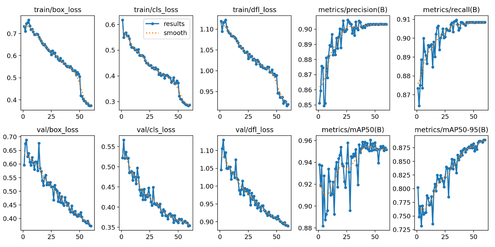
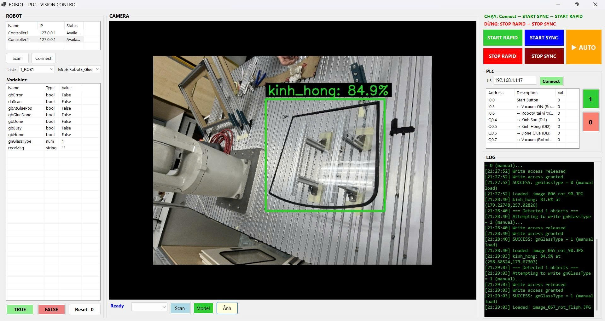

# 🤖 Robotic Glazing System (Hệ Thống Robot Tra Keo Tự Động)

Đây là phần mềm điều khiển trung tâm (PC-based Control Software) cho hệ thống tự động bôi keo (Glazing) và lắp ráp kính công nghiệp. Phần mềm điều phối nhịp nhàng giữa Camera AI, PLC Siemens và nhiều Cánh tay Robot ABB.

## 🌟 Chức năng chính

1. **Hiển thị giao diện người dùng (HMI) bằng WinForms**: Giao diện điều khiển trực quan giúp kiểm soát toàn bộ chu trình hệ thống.
2. **Thị giác máy tính (Computer Vision) với YOLO**: Khởi chạy liên tục Camera và chạy mô hình ONNX để phát hiện và phân loại kính (`gnGlassType`). Ghi nhận lịch sử kèm tỉ lệ phần trăm độ chính xác.
3. **Giao tiếp PLC công nghiệp (Siemens)**: Nhận phản hồi tín hiệu I/O thông qua chuẩn S7, ra lệnh đóng/mở tự động Van 5/2 (Van nhả keo) và các tín hiệu tay gắp đồng bộ theo quỹ đạo di chuyển của Robot.
4. **Điều phối Robot ABB (ABB RobotStudio API)**: Giao tiếp trực tiếp với Bộ điều khiển ABB qua mạng LAN. Gửi lệnh (`HOME`, `SCAN`, `WAIT_GLUE`, `GLUE_REAR`, `GLUE_SIDE`) và đọc biến ghi/nhận từ bộ điều khiển.

## 🛠 Công nghệ sử dụng
- **Ngôn ngữ**: C# / .NET 9.0 (Windows)
- **Giao diện**: Windows Forms
- **Thị giác Máy tính**: `OpenCvSharp4`, `Microsoft.ML.OnnxRuntime`
- **Giao tiếp PLC**: Thư viện `S7netplus` (S7-1200 / S7-1500)
- **Hệ điều khiển Robot**: Bộ thư viện `ABB.Robotics.Controllers` đi kèm RobotStudio 2025.

## ⚙️ Hướng dẫn cài đặt & Chạy ứng dụng
1. Clone dự án về máy:
   ```bash
   git clone https://github.com/zablee-dev/RoboticGlazingSystem.git
   ```
2. Mở file `RoboticGlazingSystem.WinForms.sln` bằng Visual Studio 2022 trở lên.
3. **Cài đặt các thư viện (NuGet Packages)**:
   Để hệ thống chạy được, bạn cần cài các thư viện `S7netplus`, `OpenCvSharp4` và `OnnxRuntime`.
   * **Cách 1**: Chuột phải vào tên Project ở dải bên phải -> Chọn **Manage NuGet Packages** -> Chuyển sang tab **Browse**, gõ từng tên thư viện (`S7netplus`, `OpenCvSharp4`, `Microsoft.ML.OnnxRuntime`) rồi ấn **Install**.
   * **Cách 2**: Chạy câu lệnh nhanh. Trỏ thanh menu trên cùng ở VS: `Tools > NuGet Package Manager > Package Manager Console` và copy dán khối lệnh này vào Enter:
     ```powershell
     Install-Package S7netplus -Version 0.20.0
     Install-Package OpenCvSharp4 -Version 4.11.0.20250507
     Install-Package OpenCvSharp4.Extensions -Version 4.11.0.20250507
     Install-Package OpenCvSharp4.runtime.win -Version 4.11.0.20250507
     Install-Package Microsoft.ML.OnnxRuntime -Version 1.23.2
     ```
   *(Lưu ý: Thư viện điều khiển hệ Robot ABB đã được em bóc tách và nhúng trực tiếp kèm code ở thư mục `Libraries/ABB` nên không cần bận tâm phần mềm RobotStudio nữa).*
4. Nhấn **F5** để chạy dự án.

## 📸 Giao diện & Kiến trúc hoạt động thực tế


> **AI Computer Vision**: Chạy mô hình YOLO dưới dạng chuẩn ONNX để theo dõi và bắt bounding box hình ảnh kính. Phần mềm nhận hình liên tục, phân loại ra các ID chuẩn (`gnGlassType`) và truyền Parameter Realtime qua Robot.


> **Phần mềm điều khiển chính (PC-based HMI)**: Nhóm tính năng được chia khu vực cực kỳ mạch lạc. Khối quét Robot tự động kết nối TCP/IP qua cổng xxxx, Khối điều khiển Sync Rate hệ thống, và Khối LOG (nhật ký) ghi trạng thái realtime từng miligiây rất chuyên nghiệp thao tác người dùng.


> **Giám sát tín hiệu I/O trạm trung tâm**: Các đèn báo I/O xanh/đỏ (Q0.6, I0.6, M6.6...) để anh em kỹ thuật kiểm tra và bật/tắt (Force Set/Reset) trực tiếp tín hiệu phần cứng trét keo giữa PC và PLC Siemens thông qua Profinet, dễ dàng bảo trì hoặc dò đấu nối dây mảng tủ điện.

## 🔄 Tổng quan luồng Chu Trình Tự Động (Auto Cycle)
Khi nhấn nút **▶ AUTO RUN**, hệ thống bắt đầu chu trình khép kín:
1. Xác nhận các kết nối Robot Tự động, Khởi động PLC, ra lệnh Robot về Home (Gốc).
2. Khi có tín hiệu Start vật lý (từ I0.0), tự bật Camera.
3. Chạy `YoloOnnx` phát hiện kính. Lưu dữ liệu phân loại báo về Robot bằng bộ Request (Gửi Lệnh SCAN).
4. PC theo dõi trạng thái xem `Robot A` đi vào điểm nhả keo xong chưa (I0.6).
5. Khi Robot A Done, PC Gửi lệnh thực thi nhả Keo `GLUE` tới cánh tay `Robot B`.
6. Tự động bật mở van khí nén bơm keo liên tục dựa theo tracking tọa độ. Khi `Robot B` báo kết thúc (`gbGlueDone` = True), tắt Van + Báo luôn cho `Robot A` mang kính đi lắp.
7. Khi hoàn tất, hệ thống ra lệnh giải tĩnh điện Reset toàn cục, kết thúc quy trình nhịp nhàng.
